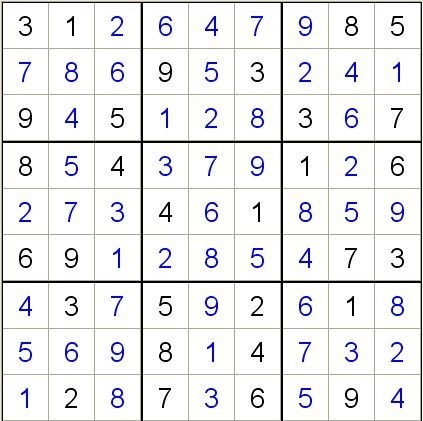

# Lab 1: “Super-fast” Sudoku Solving

## 1. Overview

Implement a sudoku solving program, using multiple threads or multiple processes, running on a single machine.

## 2. Background

### 2.1 Introduction to Sudoku

Sudoku (originally called Number Place) is a logic-based combinatorial number-placement puzzle. 

The objective is to fill a 9×9 grid with digits so that each column, each row, and each of the nine 3×3 subgrids that compose the grid (also called "boxes", "blocks", or "regions") contain all of the digits from 1 to 9. The puzzle setter provides a partially completed grid, which for a well-posed puzzle has a single solution.

<div align=center>


</div>

Completed games are always an example of a Latin square which include an additional constraint on the contents of individual regions. For example, the same single integer may not appear twice in the same row, column, or any of the nine 3×3 subregions of the 9×9 playing board.

<div align=center>


</div>

### 2.2 A little resources

If you know a little about algorithms that can use to solve Sudoku. We suggest you click on this [link](https://rafal.io/posts/solving-sudoku-with-dancing-links.html). And some code implementation is available on [here](src/Sudoku/).

## 3. Your Lab Task

### 3.1 Write a program 

Implementing the following features:

#### 3.1.1 Program input

**Input:** The name of a file from *stdin*.

**[Note on input]:** The input file may be very large (e.g. 10GB+). In the file, each line is a Sudoku puzzle.

Example file format:
```
310000085000903000905000307804000106000401000690000073030502010000804000020706090
000000010400000000020000000000050407008000300001090000300400200050100000000806000
000000013000030080070000000000206000030000900000010000600500204000400700100000000

notes:
The first Sudoku puzzle (first line) corresponds to:

---------------------
3 1 0 | 0 0 0 | 0 8 5
0 0 0 | 9 0 3 | 0 0 0
9 0 5 | 0 0 0 | 3 0 7
---------------------
8 0 4 | 0 0 0 | 1 0 6 
0 0 0 | 4 0 1 | 0 0 0 
6 9 0 | 0 0 0 | 0 7 3
---------------------
0 3 0 | 5 0 2 | 0 1 0
0 0 0 | 8 0 4 | 0 0 0
0 2 0 | 7 0 6 | 0 9 0
---------------------
```

#### 3.1.2 Program output

**output:** The answer of each sudoku in file.

**[Note on output]:** Output from *stdout*, and correspond to the input. You should list all the answers of Sudoku puzzle that have ever appeared in the file. And, don't forget to calculate the elapsed time.

Example output (matching the input example above):
```
312647985786953241945128367854379126273461859691285473437592618569814732128736594
693784512487512936125963874932651487568247391741398625319475268856129743274836159
869725413512934687374168529798246135231857946456319872683571294925483761147692358
```
or
```
3 1 2 6 4 7 9 8 5 
7 8 6 9 5 3 2 4 1 
9 4 5 1 2 8 3 6 7 
8 5 4 3 7 9 1 2 6 
2 7 3 4 6 1 8 5 9 
6 9 1 2 8 5 4 7 3 
4 3 7 5 9 2 6 1 8 
5 6 9 8 1 4 7 3 2 
1 2 8 7 3 6 5 9 4
-----------------

6 9 3 7 8 4 5 1 2 
4 8 7 5 1 2 9 3 6 
1 2 5 9 6 3 8 7 4 
9 3 2 6 5 1 4 8 7 
5 6 8 2 4 7 3 9 1 
7 4 1 3 9 8 6 2 5 
3 1 9 4 7 5 2 6 8 
8 5 6 1 2 9 7 4 3 
2 7 4 8 3 6 1 5 9
-----------------

8 6 9 7 2 5 4 1 3 
5 1 2 9 3 4 6 8 7 
3 7 4 1 6 8 5 2 9 
7 9 8 2 4 6 1 3 5 
2 3 1 8 5 7 9 4 6 
4 5 6 3 1 9 8 7 2 
6 8 3 5 7 1 2 9 4 
9 2 5 4 8 3 7 6 1 
1 4 7 6 9 2 3 5 8
-----------------
```

#### 3.1.3 Implementation requirements 

##### 3.1.3.1 Basic version

Solve the Sudoku in the file with as many threads/processes as possible (It depends on the number of cores in your machine). In order to be as fast as possible, you should make the most of CPU cores.

##### 3.1.3.2 Advanced version

Besides the “basic” functions: When the program is in process of solving Sudoku in the previously input file(s), the program can continuously receive more input file names from *stdin*.

**[Optimization tips]**

 - Monitor the utilization of each CPU core, so that you can allocate CPU resources more reasonably.

 - Consider what you should do when the input file is very large. 

### 3.2. Finish	a performance test report

Please test your code first, and commit a test report along with your lab code into your group’s course github repo. 
The test report should contain several sample test inputs, and the performance result under various testing conditions. Specifically, in your test report, you should at least contain the following two things:
1)	Compare the performance of your “super-fast” word-count program with a simple single-thread version, using the same input and under the same environment.
2)	Change the input (e.g., change file size, word pattern) and environment (e.g., using machines with different CPUs and hard drives), and draw several curves of your program’s performance under various conditions.

## 4. Lab submission

Please submit your lab program and performance test report following the guidance in the [Overall Lab Instructions](../README.md)

## 5. Grading standards

TBC